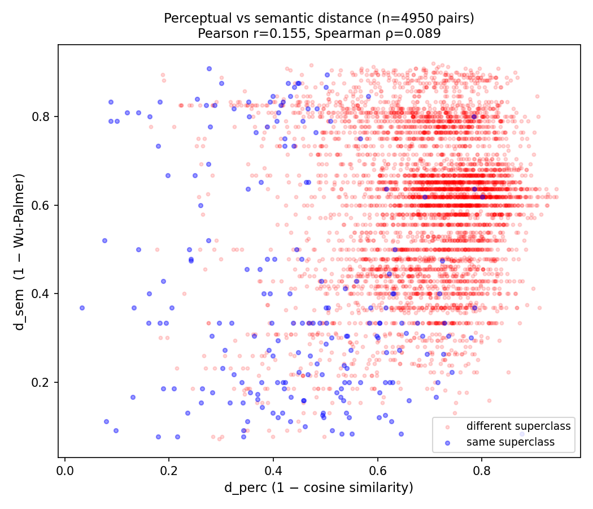
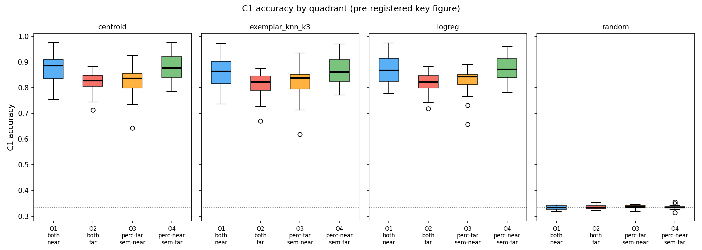
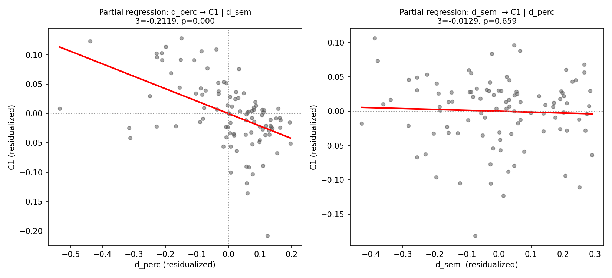
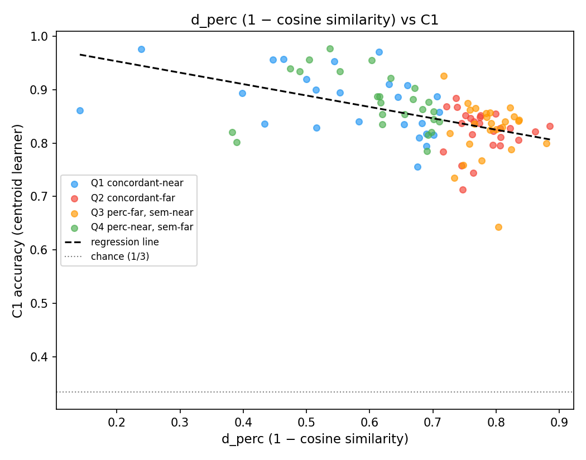
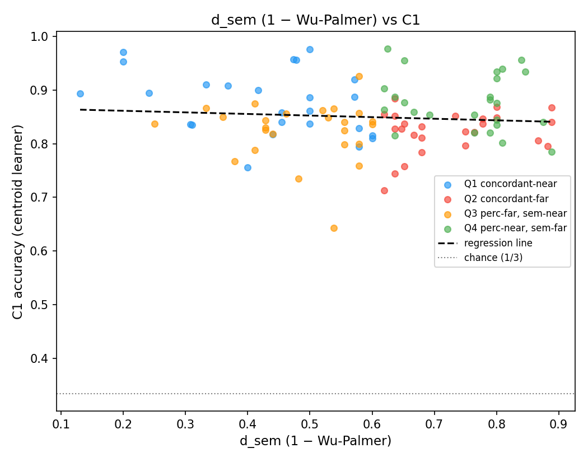

# exp_008 Dissociation Experiment — Run Report

## Run metadata
- Timestamp: 20260608_173255
- Master seed: 42
- Encoder: facebook/dinov2-small
- Dataset: CIFAR-100 (torchvision)
- Total images embedded: N/A
- Embedding dimension: 384

## Phase 1 — Distance Matrices
- Pearson r(d_perc, d_sem): **0.1555** (p=3.71e-28)
- Spearman ρ(d_perc, d_sem): **0.0886** (p=4.21e-10)
- Interpretation: Moderate to low collinearity (|r|=0.155). Adequate dissociation power expected.

### Top 5 most perceptually distant pairs
| class_u | class_v | d_perc | d_sem |
|---------|---------|--------|-------|
| bed | poppy | 0.943 | 0.6364 |
| keyboard | poppy | 0.9429 | 0.619 |
| orchid | wardrobe | 0.9378 | 0.619 |
| keyboard | orchid | 0.9301 | 0.619 |
| chair | mountain | 0.9261 | 0.625 |

### Top 5 most semantically distant pairs
| class_u | class_v | d_perc | d_sem |
|---------|---------|--------|-------|
| cattle | ray | 0.7063 | 0.92 |
| dolphin | ray | 0.4722 | 0.9167 |
| chimpanzee | ray | 0.7239 | 0.9167 |
| cattle | table | 0.7345 | 0.913 |
| lion | ray | 0.7158 | 0.913 |

### Top 5 most dissociated pairs (largest |rank_perc − rank_sem|)
| class_u | class_v | d_perc | d_sem | rank_gap |
|---------|---------|--------|-------|----------|
| orchid | sunflower | 0.8765 | 0.0833 | 4877 |
| ray | shark | 0.2762 | 0.9091 | 4871 |
| forest | pine_tree | 0.1873 | 0.8947 | 4850 |
| forest | willow_tree | 0.1901 | 0.8824 | 4793 |
| ray | turtle | 0.3006 | 0.8889 | 4760 |

## Phase 2 — Pair Selection
- Pairs per quadrant: Q1=1255, Q2=1444, Q3=1031, Q4=1220
- Sampled: Q1=25, Q2=25, Q3=25, Q4=25

**Sampled pairs (first 10 rows):**
| sample_id | class_u | class_v | quadrant | d_perc | d_sem |
|-----------|---------|---------|----------|--------|-------|
| 0 | beaver | ray | Q1 | 0.5157 | 0.5789 |
| 1 | bed | chair | Q1 | 0.6143 | 0.2000 |
| 2 | bee | beetle | Q1 | 0.3984 | 0.1304 |
| 3 | beetle | camel | Q1 | 0.6897 | 0.4400 |
| 4 | bottle | television | Q1 | 0.6594 | 0.3684 |
| 5 | bowl | spider | Q1 | 0.6779 | 0.6000 |
| 6 | castle | turtle | Q1 | 0.6830 | 0.5000 |
| 7 | chimpanzee | crab | Q1 | 0.6452 | 0.5000 |
| 8 | chimpanzee | kangaroo | Q1 | 0.6542 | 0.3103 |
| 9 | clock | motorcycle | Q1 | 0.7102 | 0.4545 |
*(... 90 more rows in sampled_pairs.csv)*

## Phase 3 — C1 Acquisition Results
- Total episodes run: 12000

**Per-quadrant mean C1 (centroid learner):**

| Quadrant | Description | Mean C1 | 95% CI |
|----------|-------------|---------|--------|
| Q1 | both near | 0.8760 | [0.8635, 0.8884] |
| Q2 | both far | 0.8218 | [0.8101, 0.8334] |
| Q3 | perc-far, sem-near | 0.8236 | [0.8117, 0.8359] |
| Q4 | perc-near, sem-far | 0.8770 | [0.8644, 0.8898] |

**Per-learner summary (mean C1 by quadrant):**

| Learner | Q1 | Q2 | Q3 | Q4 |
|---------|----|----|----|----|
| centroid | 0.876 | 0.822 | 0.824 | 0.877 |
| exemplar_knn_k3 | 0.865 | 0.813 | 0.819 | 0.866 |
| logreg | 0.875 | 0.820 | 0.825 | 0.875 |
| random | 0.334 | 0.335 | 0.335 | 0.334 |

### Raw data cross-check (positions 0, 33, 66 in sampled_pairs.csv)

**Position 0:** beaver + ray | Q1 | d_perc=0.5157 | d_sem=0.5789
- Episode C1 values (centroid): 0.820, 0.813, 0.893, 0.840, 0.787, 0.767, 0.840, 0.807, 0.860, 0.820, 0.847, 0.827, 0.827, 0.880, 0.800, 0.853, 0.853, 0.833, 0.800, 0.800, 0.793, 0.827, 0.800, 0.827, 0.867, 0.753, 0.900, 0.820, 0.867, 0.847
- Aggregated C1: 0.8289 [0.8169, 0.8409]

**Position 33:** chimpanzee + wardrobe | Q2 | d_perc=0.8075 | d_sem=0.6800
- Episode C1 values (centroid): 0.813, 0.807, 0.827, 0.807, 0.813, 0.833, 0.793, 0.807, 0.773, 0.807, 0.800, 0.800, 0.813, 0.807, 0.813, 0.820, 0.827, 0.813, 0.800, 0.813, 0.800, 0.813, 0.827, 0.807, 0.820, 0.807, 0.820, 0.807, 0.820, 0.820
- Aggregated C1: 0.8109 [0.8064, 0.8149]

**Position 66:** keyboard + snail | Q3 | d_perc=0.8353 | d_sem=0.6000
- Episode C1 values (centroid): 0.800, 0.887, 0.840, 0.847, 0.833, 0.813, 0.860, 0.813, 0.787, 0.847, 0.813, 0.873, 0.840, 0.927, 0.900, 0.873, 0.813, 0.820, 0.873, 0.840, 0.813, 0.853, 0.827, 0.833, 0.847, 0.820, 0.800, 0.827, 0.907, 0.813
- Aggregated C1: 0.8413 [0.8298, 0.8536]

## Phase 4 — Regression Analysis

**Model P (perceptual only, centroid learner):**
- β_perc = -0.2136 [-0.2878, -0.1394], p = 0.0000, R² = 0.2498

**Model S (semantic only, centroid learner):**
- β_sem = -0.0296 [-0.0957, 0.0365], p = 0.3760, R² = 0.0080

**Model PS (both predictors, centroid learner):**
- β_perc = -0.2119 [-0.2868, -0.1370], p = 0.0000
- β_sem = -0.0129 [-0.0709, 0.0451], p = 0.6603
- R² = 0.2513, VIF_perc = 9.6930, VIF_sem = 9.6930
- Partial R²_perc = 0.2453, Partial R²_sem = 0.0020

**Likelihood ratio test (Model P vs Model PS):** χ² = 0.2001, p = 0.6546
**Likelihood ratio test (Model S vs Model PS):** χ² = 28.1394, p = 0.0000

## Dissociation Subset Analysis (Q3 + Q4 only)
- N pairs in dissociation subset (Q3+Q4): 50
- Spearman(C1, d_perc) in Q3+Q4: ρ = -0.4750, p = 0.0005
- Spearman(C1, d_sem) in Q3+Q4: ρ = 0.3272, p = 0.0204
- Median C1: Q3 = 0.8367, Q4 = 0.8762

## Decision
**Rule triggered: A**

**Evidence:**
- A1: β_perc=-0.2119 significant (p=0.000) and negative ✓
- A2: β_sem not dominant (p=0.660, partial_R²_perc/partial_R²_sem=0.2453/0.0020) ✓
- A3: Spearman(C1,d_perc) in Q3+Q4 = -0.475 (negative, |ρ|>0.3, |ρ_perc|>|ρ_sem|=0.327) ✓
- A4: Q4 median C1=0.876 > Q3 median C1=0.837 ✓

**Recommended paper action:** Add §3.X 'The perceptual-coherence gradient is not a measurement tautology' with quadrant boxplot as main-text figure.

## Raw Data Inventory
| File | Size (KB) | Rows |
|------|-----------|------|
| exp_008_decision.md | 0 | — |
| phase1\perceptual_distance_matrix.csv | 184 | 100 |
| phase1\phase1_correlation_report.json | 2 | — |
| phase1\phase1_scatter.png | 192 | — |
| phase1\raw\centroids.npy | 300 | — |
| phase1\semantic_distance_matrix.csv | 157 | 100 |
| phase1\wordnet_mappings_used.json | 2 | — |
| phase2\quadrant_counts.json | 0 | — |
| phase2\raw\all_pairs_quadrants.csv | 381 | 4950 |
| phase2\sampled_pairs.csv | 8 | 100 |
| phase3\exp_008_c1_results.csv | 35 | 400 |
| phase3\exp_008_episode_results.csv | 912 | 12000 |
| phase3\raw\progress.jsonl | 4 | — |
| phase4\dissociation_analysis.json | 1 | — |
| phase4\fig_heatmap_overlay.png | 137 | — |
| phase4\fig_partial_regression.png | 86 | — |
| phase4\fig_quadrant_boxplot.png | 52 | — |
| phase4\fig_scatter_perc_vs_c1.png | 79 | — |
| phase4\fig_scatter_sem_vs_c1.png | 74 | — |
| phase4\raw\statsmodels_summary_centroid_modelP.txt | 1 | — |
| phase4\raw\statsmodels_summary_centroid_modelPS.txt | 1 | — |
| phase4\raw\statsmodels_summary_centroid_modelS.txt | 1 | — |
| phase4\raw\statsmodels_summary_exemplar_knn_k3_modelP.txt | 1 | — |
| phase4\raw\statsmodels_summary_exemplar_knn_k3_modelPS.txt | 1 | — |
| phase4\raw\statsmodels_summary_exemplar_knn_k3_modelS.txt | 1 | — |
| phase4\raw\statsmodels_summary_logreg_modelP.txt | 1 | — |
| phase4\raw\statsmodels_summary_logreg_modelPS.txt | 1 | — |
| phase4\raw\statsmodels_summary_logreg_modelS.txt | 1 | — |
| phase4\raw\statsmodels_summary_random_modelP.txt | 1 | — |
| phase4\raw\statsmodels_summary_random_modelPS.txt | 1 | — |
| phase4\raw\statsmodels_summary_random_modelS.txt | 1 | — |
| phase4\regression_table.csv | 1 | 4 |
